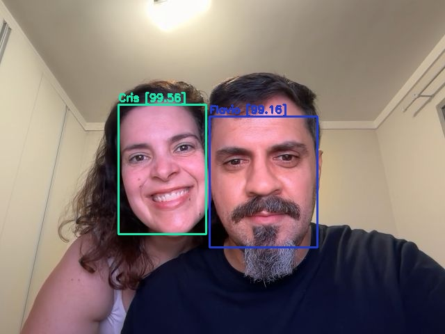

# Bootcamp DIO BairesDev - Machine Learning Practitioner

Repositório dedicado aos projetos propostos no bootcamp **BairesDev - Machine Learning Practitioner** da [DIO](https://web.dio.me)

## Redução de Dimensionalidade em Imagens para Redes Neurais

Projeto desenvolvido em python para conversão de imagens RGB para escala de cinza e preto e branco.

- [Notebook](notebooks/reducao-dimensionalidade.ipynb)

## Cálculo de Métricas de Avaliação de Aprendizado

Neste projeto, vamos calcular as principais métricas para avaliação de modelos de classificação de dados:

- Acurácia
- Sensibilidade (recall)
- Especificidade
- Precisão
- F-score
  
- [Notebok com cálculo das métricas](notebooks/metricas-avaliacao-aprendizado.ipynb)

## Transfer learning / Fine tunning

Transfer learning / fine-tunning utilizando o modelo [VGG16](https://arxiv.org/pdf/1409.1556.pdf), realizado com o objetivo de classificar imagens de **Maradona** e **Pelé**.

- [Notebook](notebooks/transfer_learning.ipynb)

## Criação de Uma Base de Dados e Treinamento da Rede YOLO

Treinamento customizado da Rede YOLOv3 com a detecção das seguintes classes:
- fish
- jellyfish
- penguin
- puffin
- shark
- starfish
- stingray
  
- [Notebook de treinamento customizado](darknet/YOLOv3_custom_object_training.ipynb)

## Sistema de Reconhecimento Facial
Treinamento customizado da Rede YOLOv3 para reconhecimento facial, com detecção e classificação da imagem obtida através da webcam.

 - [Notebook de treinamento](darknet_face_detection/YOLOv3_custom_object_training.ipynb)
 - [Notebook de reconhecimento facial com webcam](darknet_face_detection/yolov3_webcam.ipynb)

> O dataset e a rede treinada não foram disponibilizados neste repositório. 

Exemplo do reconhecimento facial:
